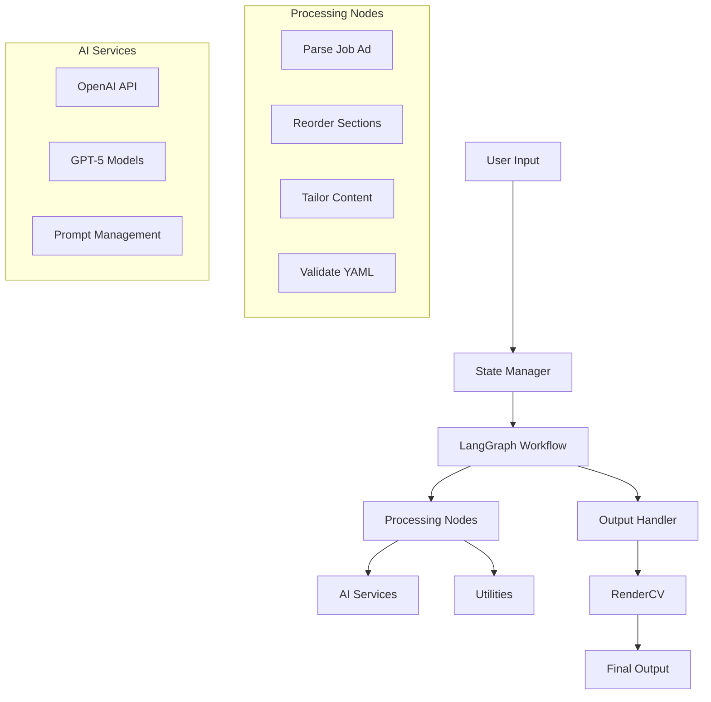
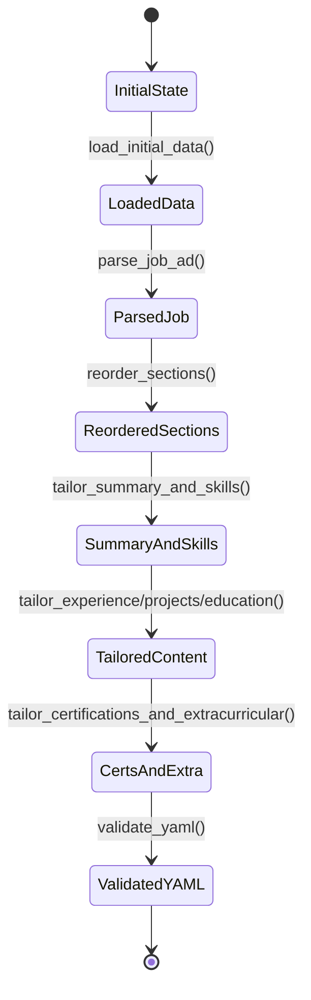

# Resume Agent Developer Guide

> 🛠️ Technical documentation for developers working on the Resume Agent project

[](https://www.python.org/)
[](https://langchain-ai.github.io/langgraph/)
[](https://openai.com/)

## Table of Contents

- [Architecture Overview](#architecture-overview)
- [Code Structure](#code-structure)
- [State Management](#state-management)
- [Workflow System](#workflow-system)
- [Node Development](#node-development)
- [AI Integration](#ai-integration)
- [Testing Guide](#testing-guide)
- [Deployment](#deployment)
- [Contributing](#contributing)

## Architecture Overview

Resume Agent is built on a modular architecture using LangGraph for workflow orchestration and OpenAI for AI-powered content generation.

### System Components



### Design Principles

1. **Modular Design**: Each node handles a specific responsibility
2. **State Immutability**: State is passed through workflow without side effects
3. **Error Isolation**: Errors in one node don't crash the entire pipeline
4. **Extensibility**: Easy to add new nodes or modify existing ones
5. **Testability**: Each component can be tested independently

## Code Structure

### Directory Layout

```
resume_agent/
├── 📁 nodes/                    # Workflow processing nodes
│   ├── json_utils.py           # JSON parsing utilities
│   ├── parse_job_ad.py         # Job advertisement analysis (gpt-5-nano)
│   ├── reorder_sections.py     # Section prioritization (gpt-5-nano)
│   ├── tailor_summary_and_skills.py  # Summary + skills (gpt-5.2)
│   ├── tailor_experience.py    # Experience optimization (gpt-5.2)
│   ├── tailor_projects.py      # Project selection (gpt-5.2)
│   ├── tailor_education.py     # Education tailoring (gpt-5-nano)
│   ├── tailor_certifications_and_extracurricular.py  # Certs + activities (gpt-5-nano)
│   └── validate_yaml.py        # YAML structure validation (no LLM)
├── 📁 utils/                   # Shared utilities
│   ├── __init__.py            # Utils package initialization
│   └── text_utils.py          # Text processing functions
├── 📁 markdown/               # RenderCV template files
├── 📁 rendercv_output/        # Generated output files
├── 🐍 state.py               # State management and types
├── 🐍 run.py                 # Workflow orchestration
├── 🌐 resume_agent_ui.py     # Web interface (form-based editor)
├── 🐍 start_ui.py            # Web UI launcher
└── 🐍 setup_env.py           # Environment setup utilities
```

### Key Files

| File | Purpose | Dependencies |
|------|---------|--------------|
| `state.py` | State management and type definitions | PyYAML, typing |
| `resume_agent_ui.py` | Web interface and workflow orchestration | Flask, LangGraph, all nodes |
| `start_ui.py` | Web UI launcher with setup | Flask |
| `nodes/*.py` | Individual processing nodes | OpenAI, state |
| `utils/*.py` | Shared utility functions | Various |

## State Management

### ResumeState Type

The `ResumeState` TypedDict defines the complete state structure:

```python
class ResumeState(TypedDict):
    # Input data
    master_cv: Dict[str, Any]      # Original CV data
    job_advertisement: str         # Job posting text
    
    # Working data
    working_cv: Dict[str, Any]     # CV being modified
    
    # Analysis results
    job_requirements: Dict[str, Any]  # Parsed requirements
    tailoring_plan: Dict[str, Any]    # Tailoring strategy
    
    # Processing flags
    job_parsed: bool
    sections_reordered: bool
    summary_updated: bool
    # ... more flags
    
    # Error handling
    errors: List[str]
    warnings: List[str]
    
    # Output
    output_file: Optional[str]
    removed_sections: List[str]
```

### State Flow



### State Utilities

```python
# State creation
def create_initial_state() -> ResumeState:
    """Create initial state with default values"""
    
# File operations
def load_cv_from_file(filepath: str) -> Dict[str, Any]:
    """Load CV data from YAML file"""
    
def save_cv_to_file(cv_data: Dict[str, Any], filepath: str) -> None:
    """Save CV data to YAML file"""
```

## Workflow System

### LangGraph Integration

The workflow uses LangGraph's `StateGraph` for orchestrating the resume tailoring process:

```python
def setup_workflow() -> StateGraph:
    """Set up the LangGraph workflow"""
    workflow = StateGraph(ResumeState)
    
    # Add nodes (8 total: 6 LLM calls + 1 validation + entry/exit)
    workflow.add_node("parse_job_ad", parse_job_ad)
    workflow.add_node("reorder_sections", reorder_sections)
    workflow.add_node("tailor_summary_and_skills", tailor_summary_and_skills)
    workflow.add_node("tailor_experience", tailor_experience)
    workflow.add_node("tailor_projects", tailor_projects)
    workflow.add_node("tailor_education", tailor_education)
    workflow.add_node("tailor_certifications_and_extracurricular", tailor_certifications_and_extracurricular)
    workflow.add_node("validate_yaml", validate_yaml)

    # Define sequential edges
    workflow.add_edge(START, "parse_job_ad")
    workflow.add_edge("parse_job_ad", "reorder_sections")
    workflow.add_edge("reorder_sections", "tailor_summary_and_skills")
    # ... experience → projects → education → certs_and_extra → validate → END
    
    return workflow
```

### Workflow Execution

```python
# Web interface execution
def run_workflow_via_web():
    """Execute workflow through web interface"""
    state = load_initial_data()
    workflow = setup_workflow()
    app = workflow.compile()
    
    # Execute workflow with progress tracking
    result = app.invoke(state)
    
    # Handle output
    save_working_cv(result)
    render_cv()
    return result
```


## Node Development

### Node Interface

All nodes must follow this interface:

```python
def node_function(state: ResumeState) -> ResumeState:
    """
    Process the resume state and return updated state.
    
    Args:
        state: Current resume state
        
    Returns:
        Updated resume state with changes applied
    """
    print("🔧 Starting node processing...")
    
    try:
        # Node logic here
        # Modify state as needed
        state['some_flag'] = True
        
        print("✅ Node completed successfully")
        
    except Exception as e:
        error_msg = f"Error in node_function: {str(e)}"
        print(f"❌ {error_msg}")
        state['errors'].append(error_msg)
    
    return state
```

### Error Handling

Nodes should handle errors gracefully:

```python
def robust_node(state: ResumeState) -> ResumeState:
    """Example of proper error handling"""
    try:
        # Risky operation
        result = ai_api_call(state['job_advertisement'])
        
        # Validate result
        if not result or 'error' in result:
            raise ValueError("Invalid AI response")
            
        # Apply changes
        state['working_cv'] = apply_changes(state['working_cv'], result)
        
    except Exception as e:
        # Log error
        error_msg = f"Node failed: {str(e)}"
        state['errors'].append(error_msg)
        
        # Provide fallback
        state['warnings'].append("Using fallback behavior")
        
    return state
```

### Node Testing

```python
def test_node():
    """Test node functionality"""
    # Create test state
    test_state = create_initial_state()
    test_state['master_cv'] = load_test_cv()
    test_state['job_advertisement'] = load_test_job_ad()
    
    # Execute node
    result_state = node_function(test_state)
    
    # Verify results
    assert result_state['some_flag'] == True
    assert len(result_state['errors']) == 0
```

## AI Integration

### OpenAI API Usage

The system uses OpenAI's API for content generation:

```python
from openai import OpenAI
import os

client = OpenAI(api_key=os.getenv('OPENAI_API_KEY'))

def call_openai_api(prompt: str, model: str = "gpt-5.2") -> str:
    """Call OpenAI API with error handling"""
    try:
        response = client.chat.completions.create(
            model=model,
            messages=[{"role": "user", "content": prompt}],
            temperature=0.3
        )
        return response.choices[0].message.content
        
    except Exception as e:
        print(f"OpenAI API error: {e}")
        return None
```

### Prompt Engineering

#### Prompt Structure

```python
def create_prompt(job_requirements: Dict, cv_section: Dict) -> str:
    """Create optimized prompt for content tailoring"""
    
    base_prompt = f"""
    ROLE: You are a professional resume writer specializing in {job_requirements['field']}.
    
    TASK: Tailor the following CV section to match the job requirements.
    
    JOB REQUIREMENTS:
    {format_job_requirements(job_requirements)}
    
    CURRENT CV SECTION:
    {format_cv_section(cv_section)}
    
    CONSTRAINTS:
    - Maintain truthfulness - do not invent experience
    - Only use skills/technologies mentioned in the original CV
    - Preserve dates and company names exactly
    - Focus on relevance to the target role
    
    OUTPUT FORMAT: Valid YAML matching the input structure
    """
    
    return base_prompt
```

#### Anti-Hallucination Safeguards

```python
def validate_ai_response(original_data: Dict, ai_response: Dict) -> bool:
    """Validate AI response against original data"""
    
    # Check for invented skills
    original_skills = extract_skills(original_data)
    response_skills = extract_skills(ai_response)
    
    if not set(response_skills).issubset(set(original_skills)):
        return False
    
    # Check for modified dates/companies
    if dates_modified(original_data, ai_response):
        return False
        
    return True
```

### Model Selection

| Node | Model | Reason |
|------|-------|---------|
| `parse_job_ad` | GPT-5-nano | Cost-effective for structured extraction |
| `reorder_sections` | GPT-5-nano | Simple structural decision |
| `tailor_summary_and_skills` | GPT-5.2 | Critical quality gate with cross-validation |
| `tailor_experience` | GPT-5.2 | Complex rewriting, anti-hallucination |
| `tailor_projects` | GPT-5.2 | Technology accuracy, judgment-heavy |
| `tailor_education` | GPT-5-nano | Factual reordering of highlights |
| `tailor_certifications_and_extracurricular` | GPT-5-nano | Simple filtering of two lists |
| `validate_yaml` | No LLM | Pure structural validation code |

## Testing Guide

### Unit Testing

```python
import unittest
from unittest.mock import Mock, patch

class TestJobAdParser(unittest.TestCase):
    def setUp(self):
        self.test_state = create_initial_state()
        self.test_state['job_advertisement'] = load_test_job_ad()
    
    @patch('openai.ChatCompletion.create')
    def test_parse_job_ad_success(self, mock_openai):
        """Test successful job ad parsing"""
        # Mock OpenAI response
        mock_openai.return_value.choices[0].message.content = '{"skills": ["Python"]}'
        
        # Execute node
        result = parse_job_ad(self.test_state)
        
        # Verify results
        self.assertTrue(result['job_parsed'])
        self.assertIn('skills', result['job_requirements'])
    
    def test_parse_job_ad_error_handling(self):
        """Test error handling in job ad parsing"""
        # Invalid state
        invalid_state = create_initial_state()
        
        # Execute node
        result = parse_job_ad(invalid_state)
        
        # Verify error handling
        self.assertFalse(result['job_parsed'])
        self.assertTrue(len(result['errors']) > 0)
```

### Integration Testing

```python
def test_full_workflow():
    """Test complete workflow execution"""
    # Setup test data
    test_state = create_initial_state()
    test_state['master_cv'] = load_test_cv()
    test_state['job_advertisement'] = load_test_job_ad()
    
    # Execute workflow
    workflow = setup_workflow()
    app = workflow.compile()
    result = app.invoke(test_state)
    
    # Verify final state
    assert result['yaml_validated'] == True
    assert len(result['errors']) == 0
    assert result['output_file'] is not None
```

### Mock Testing

```python
def create_mock_openai_response(content: str):
    """Create mock OpenAI response"""
    mock_response = Mock()
    mock_response.choices[0].message.content = content
    return mock_response

@patch('openai.ChatCompletion.create')
def test_with_mock_ai(mock_openai):
    """Test node with mocked AI response"""
    mock_openai.return_value = create_mock_openai_response('{"result": "success"}')
    
    # Test execution
    result = ai_dependent_node(test_state)
    
    # Verify mock was called
    mock_openai.assert_called_once()
```

## Deployment

### Environment Setup

```python
# setup_env.py
def setup_environment():
    """Setup development environment"""
    
    # Create .env file
    env_template = """
    OPENAI_API_KEY=your-api-key-here
    OPENAI_TEMPERATURE=0.3
    AUSTRALIAN_ENGLISH=false
    DEBUG=false
    """
    
    with open('.env', 'w') as f:
        f.write(env_template)
    
    print("Environment setup complete")
```

### Docker Deployment

```dockerfile
# Dockerfile
FROM python:3.9-slim

WORKDIR /app

COPY requirements.txt .
RUN pip install -r requirements.txt

COPY . .

EXPOSE 5000

CMD ["python", "start_ui.py"]
```

### Production Considerations

1. **API Key Management**: Use secure key storage in production
2. **Error Logging**: Implement proper logging for production debugging
3. **Rate Limiting**: Implement rate limiting for OpenAI API calls
4. **Monitoring**: Add health checks and monitoring
5. **Scaling**: Consider async processing for high-volume usage

## Contributing

### Development Workflow

1. **Fork and Clone**
   ```bash
   git clone https://github.com/yourusername/resume_agent.git
   cd resume_agent
   ```

2. **Setup Development Environment**
   ```bash
   python -m venv venv
   source venv/bin/activate  # or venv\Scripts\activate on Windows
   pip install -r requirements.txt
   python setup_env.py
   ```

3. **Create Feature Branch**
   ```bash
   git checkout -b feature/new-node
   ```

4. **Develop and Test**
   ```bash
   # Run tests
   python -m pytest tests/
   
   # Run linting
   python -m flake8 .
   
   # Test your changes
   python start_ui.py
   ```

5. **Submit Pull Request**
   ```bash
   git add .
   git commit -m "Add new tailoring node"
   git push origin feature/new-node
   ```

### Code Standards

- **PEP 8**: Follow Python style guidelines
- **Type Hints**: Use type annotations for all functions
- **Docstrings**: Document all functions and classes
- **Error Handling**: Implement proper exception handling
- **Testing**: Write tests for new functionality

### Adding New Nodes

1. **Create Node File**
   ```python
   # nodes/my_new_node.py
   from state import ResumeState
   
   def my_new_node(state: ResumeState) -> ResumeState:
       """Description of what this node does"""
       # Implementation
       return state
   ```

2. **Update Workflow**
   ```python
   # run.py
   from nodes.my_new_node import my_new_node

   def setup_workflow():
       workflow.add_node("my_new_node", my_new_node)
       workflow.add_edge("previous_node", "my_new_node")
   ```

3. **Add Tests**
   ```python
   # tests/test_my_new_node.py
   def test_my_new_node():
       # Test implementation
       pass
   ```

### Debugging Tips

1. **Enable Debug Output**: Check console output for detailed information
2. **Enable Debug Logging**: Set `DEBUG=true` in `.env`
3. **Check State**: Print state at each step
4. **Validate JSON**: Use `json_utils.py` for AI response parsing
5. **Test Components**: Test individual nodes separately

---

## API Reference

### State Functions

```python
create_initial_state() -> ResumeState
load_cv_from_file(filepath: str) -> Dict[str, Any]
save_cv_to_file(cv_data: Dict[str, Any], filepath: str) -> None
load_job_ad_from_file(filepath: str) -> str
```

### Utility Functions

```python
# json_utils.py
safe_json_parse(json_string: str, context: str) -> Dict[str, Any]
create_fallback_response(context: str, original_data: Any) -> Dict[str, Any]

# text_utils.py
convert_to_australian_english(text: str) -> str
extract_skills(cv_data: Dict[str, Any]) -> List[str]
```

### Workflow Functions

```python
setup_workflow() -> StateGraph
setup_interactive_workflow() -> Dict[str, Callable]
```

---

**🚀 Ready to contribute?** Check out our [issues page](https://github.com/yourusername/resume_agent/issues) for tasks that need help, or propose new features!

*Happy coding! 🎉* 