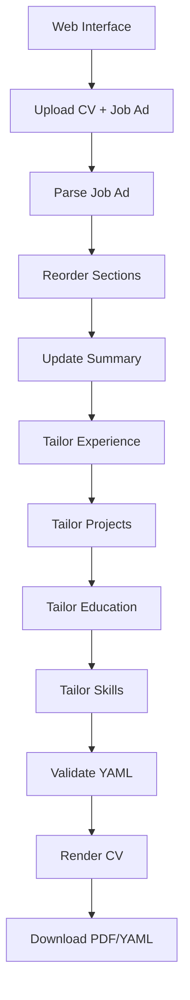

# Resume Agent - AI-Powered Resume Tailoring System

> 🤖 An intelligent resume tailoring system that automatically customizes your CV based on job advertisements using a modern web interface powered by LangGraph and OpenAI's GPT-4.

[](https://www.python.org/downloads/)
[](https://openai.com/)
[](https://rendercv.com/)

## Table of Contents

- [Overview](#overview)
- [Key Features](#key-features)
- [Quick Start](#quick-start)
- [Installation](#installation)
- [Usage](#usage)
- [Configuration](#configuration)
- [System Architecture](#system-architecture)
- [AI Safety & Accuracy](#ai-safety--accuracy)
- [Best Practices](#best-practices)
- [Troubleshooting](#troubleshooting)
- [Contributing](#contributing)

## Overview

Resume Agent uses a sophisticated multi-step AI workflow to analyze job advertisements and tailor your resume accordingly. The system provides a complete web-based interface with real-time progress tracking, integrated editing, and professional PDF generation. It ensures maximum relevance and impact while maintaining accuracy and professionalism through built-in safeguards against AI hallucination.

### What Makes Resume Agent Different

- **Complete Web Interface**: Modern, user-friendly web application with progress tracking
- **Anti-Hallucination Protection**: Prevents AI from inventing skills or experience not in your master CV
- **Integrated Workflow**: Seamless experience from upload to final PDF download
- **Australian English Support**: Built-in localization for Australian job market
- **Professional Rendering**: Generates PDF, HTML, and other formats using RenderCV
- **Truth-First Approach**: Emphasizes honesty over perfect job matching

## Key Features

### 🎯 **Intelligent Analysis**
- **Job Advertisement Parsing**: Extracts key requirements, technologies, and company culture
- **Section Prioritization**: Reorders resume sections based on job emphasis
- **Content Optimization**: Tailors professional summary, experience, projects, and skills
- **Cross-Reference Validation**: Ensures consistency across all resume sections

### 🔒 **AI Safety & Accuracy**
- **Skills Validation**: Only mentions skills explicitly listed in your master CV
- **Experience Verification**: No professional experience is invented or inflated
- **Fallback Mechanisms**: Uses original content if AI responses are invalid
- **Truth Preservation**: Maintains honest representation of your background

### 🌐 **Complete Web Interface**
- **Modern UI**: Clean, intuitive web-based interface
- **Progress Tracking**: Real-time updates during AI processing
- **Integrated Editor**: Built-in YAML editor with syntax highlighting
- **Live Preview**: Real-time PDF preview as you edit
- **File Upload**: Drag-and-drop CV file upload
- **Easy Downloads**: One-click download of YAML and PDF files
- **Auto-save**: Automatic saving and rendering
- **Responsive Design**: Works on desktop and mobile devices

### 🎨 **Professional Output**
- **Multi-Format Support**: PDF, HTML, PNG, and Markdown outputs
- **RenderCV Integration**: Professional templates and themes
- **Quality Assurance**: YAML validation and error checking

## Quick Start

```bash
# 1. Clone and setup
git clone https://github.com/yourusername/Resume_Agent.git
cd Resume_Agent
pip install -r requirements.txt

# 2. Configure API key
python setup_env.py
# Edit .env file with your OpenAI API key

# 3. Start the web interface
python start_ui.py               # Launch web UI
# Or on Windows: start_ui.bat

# 4. Open your browser and go to http://localhost:5000
```

## Installation

### Prerequisites
- Python 3.7 or higher
- OpenAI API key ([Get one here](https://platform.openai.com/api-keys))

### Step 1: Get the Code
```bash
# Option A: Clone existing repository
git clone https://github.com/yourusername/Resume_Agent.git
cd Resume_Agent

# Option B: Create new project
mkdir Resume_Agent && cd Resume_Agent
# Copy all project files here
```

### Step 2: Install Dependencies
```bash
pip install -r requirements.txt
```

> **Note**: The requirements specify `rendercv[full]` to ensure all rendering features are available. If you encounter issues, try: `pip install "rendercv[full]"`

### Step 3: Configure OpenAI API
```bash
# Recommended: Use setup script
python setup_env.py
# Then edit .env file and add your actual API key

# Alternative: Manual setup
cp env_template.txt .env
# Edit .env file manually
```

Your `.env` file should contain:
```env
OPENAI_API_KEY=your-actual-api-key-here
OPENAI_MODEL=gpt-4
OPENAI_TEMPERATURE=0.3
AUSTRALIAN_ENGLISH=false
DEBUG=false
```

## Usage

### Web Interface (Complete Workflow)

Resume Agent provides a comprehensive web-based interface for the complete resume tailoring workflow.

1. **Launch the web interface**:
   ```bash
   # Quick start
   python start_ui.py
   
   # Or on Windows
   start_ui.bat
   
   # Or directly
   python resume_agent_ui.py
   ```

2. **Open your browser**:
   - Go to: `http://localhost:5000`

3. **Complete the workflow**:
   - **Step 1**: Upload your master CV (YAML format) or paste it directly
   - **Step 2**: Paste the job advertisement text
   - **Step 3**: Click "Process with AI" and monitor real-time progress
   - **Step 4**: Make final edits using the integrated YAML editor
   - **Step 5**: Download your tailored resume (YAML and PDF)

**Web Interface Features**:
- 🌐 **Modern Interface**: Clean, intuitive web-based UI
- 📊 **Progress Tracking**: Real-time updates during AI processing
- 📝 **Integrated Editor**: Built-in YAML editor with syntax highlighting
- 👁️ **Live Preview**: Real-time PDF preview as you edit
- 📁 **File Upload**: Drag-and-drop CV file upload
- 💾 **Easy Downloads**: One-click download of YAML and PDF files
- 🔄 **Auto-save**: Automatic saving and rendering
- 📱 **Responsive**: Works on desktop and mobile devices

**Workflow Steps**:
1. **Upload Master CV**: Either upload a YAML file or use the provided template
2. **Add Job Advertisement**: Paste the complete job posting text
3. **AI Processing**: Watch real-time progress as AI analyzes and tailors your resume
4. **Edit & Refine**: Use the integrated editor to make final adjustments
5. **Download Results**: Get both YAML and PDF versions of your tailored resume

## Configuration

### Environment Variables

Create a `.env` file with these options:

| Variable | Required | Default | Description |
|----------|----------|---------|-------------|
| `OPENAI_API_KEY` | ✅ Yes | - | Your OpenAI API key |
| `OPENAI_MODEL` | No | `gpt-4` | Model for content generation |
| `OPENAI_TEMPERATURE` | No | `0.3` | Response randomness (0.0-1.0) |
| `AUSTRALIAN_ENGLISH` | No | `false` | Use Australian spelling |
| `DEBUG` | No | `false` | Enable debug logging |

### Australian English Support

Enable Australian English spelling throughout the tailoring process:

```env
AUSTRALIAN_ENGLISH=true
```

**Automatic conversions**:
- "color" → "colour"
- "center" → "centre"
- "organization" → "organisation"
- "realize" → "realise"
- And many more...

### Customization Options

- **Node Logic**: Modify tailoring rules in `nodes/` directory
- **Templates**: Customize `master_CV_template.yaml` structure
- **Rendering**: Configure RenderCV themes and formats

## System Architecture

```
Resume_Agent/
├── 📁 nodes/                    # LangGraph workflow nodes
│   ├── parse_job_ad.py         # Job advertisement analysis
│   ├── reorder_sections.py     # Section prioritization
│   ├── update_summary.py       # Professional summary tailoring
│   ├── tailor_*.py             # Content tailoring nodes
│   ├── validate_yaml.py        # YAML validation
│   └── json_utils.py           # Utility functions
├── 📁 utils/                    # Shared utilities
│   └── text_utils.py           # Text processing utilities
├── 📁 markdown/                 # RenderCV templates
├── 📁 rendercv_output/          # Generated CV files
├── 🌐 resume_agent_ui.py       # Web interface application
├── 🐍 start_ui.py              # Web UI launcher
├── 🐍 state.py                 # State management
├── 📋 requirements.txt         # Python dependencies
└── 📄 README.md               # This documentation
```

### Data Flow



## AI Safety & Accuracy

Resume Agent implements comprehensive safeguards to ensure truthful and accurate resume tailoring:

### 🛡️ Anti-Hallucination Protection

- **Skills Validation**: AI can only mention skills explicitly listed in your master CV
- **Experience Verification**: No professional experience is invented or inflated
- **Cross-Reference Checks**: Every claim is validated against your actual background
- **Fallback Mechanisms**: Invalid AI responses trigger fallback to original content

### 🎯 Truthfulness Emphasis

- **Honest Transitions**: Career changes presented truthfully (e.g., "Professional transitioning to [field]")
- **Experience Level Accuracy**: Clear distinction between professional work and academic/project experience
- **No Skill Invention**: Technical skills only mentioned if they exist in your skills section
- **Background Preservation**: Your genuine strengths emphasized over perfect job matching

### ⚙️ Technical Safeguards

- **Prompt Optimization**: Reusable prompts that work for any candidate background
- **Model Selection**: GPT-4 for content generation, GPT-3.5-turbo for job analysis
- **Token Management**: Efficient prompting to minimize costs while maintaining quality
- **Error Handling**: Comprehensive error recovery and logging

## Best Practices

### 📝 Master Resume Preparation

1. **Be Comprehensive**: Include all your experience, skills, and achievements
2. **Stay Accurate**: Ensure all dates, companies, and details are correct
3. **Use Specific Terms**: Include technical terms, tools, and methodologies
4. **Quantify Achievements**: Include metrics and measurable outcomes where possible
5. **Keep Updated**: Regularly add new experiences and skills

### 🎯 Job Advertisement Analysis

1. **Complete Postings**: Include full job descriptions, not just summaries
2. **Company Context**: Add company information and culture details when available
3. **Requirements Focus**: Ensure both required and preferred qualifications are included
4. **Technical Details**: Include specific technologies, tools, and methodologies mentioned

### 🔍 Review and Validation

1. **Human Review**: Always review AI-generated changes before submission
2. **Accuracy Check**: Verify all claims and achievements remain truthful
3. **Formatting Review**: Check PDF output for proper formatting and layout
4. **Multiple Versions**: Consider creating different versions for different types of roles

## Troubleshooting

### 🔧 Common Issues

**OpenAI API Errors**
```bash
# Check API key configuration
cat .env | grep OPENAI_API_KEY

# Verify API usage and billing
# Visit: https://platform.openai.com/usage

# Test API connection
python -c "import openai; print('API connection successful')"
```

**YAML Validation Errors**
```bash
# Check YAML syntax
python -c "import yaml; yaml.safe_load(open('master_CV.yaml'))"

# Common issues:
# - Incorrect indentation (use spaces, not tabs)
# - Missing required fields
# - Unescaped special characters
```

**RenderCV Rendering Issues**
```bash
# Verify RenderCV installation
python -m rendercv --version

# Install full version if needed
pip install "rendercv[full]"

# Test rendering manually
python -m rendercv render working_CV.yaml
```

**Web Interface Issues**
```bash
# Check if port 5000 is available
netstat -an | grep :5000

# Try alternative port
FLASK_RUN_PORT=5001 python start_ui.py

# Check browser console for JavaScript errors
# Access http://localhost:5000 and check developer tools
```

### 🔍 Debug Mode

Enable detailed logging:

```bash
# Method 1: Environment variable
DEBUG=true python start_ui.py

# Method 2: Check web interface logs
# Monitor console output while using the web interface
```

### 📊 Validation Commands

```bash
# Validate master CV structure
python -c "
from state import load_cv_from_file
cv = load_cv_from_file('master_CV.yaml')
print(f'CV Name: {cv[\"cv\"][\"name\"]}')
print(f'Sections: {list(cv[\"cv\"][\"sections\"].keys())}')
"

# Verify output files
ls -la working_CV.yaml rendercv_output/
```

## Contributing

### 🚀 Extending the System

**Add New Tailoring Nodes**
```python
# 1. Create new node in nodes/
def tailor_new_section(state: ResumeState) -> ResumeState:
    # Implementation here
    return state

# 2. Add to workflow in resume_agent_ui.py
# Update the workflow setup to include your new node
```

**Modify Web Interface**
```python
# Edit resume_agent_ui.py
# Add new routes, update templates, or modify the UI
```

**Custom Validation Rules**
```python
# Edit nodes/validate_yaml.py
# Add new validation checks for your requirements
```

### 🔄 GitHub Setup

**Create Your Own Repository**
```bash
# Initialize git (if not already done)
git init
git add .
git commit -m "Initial commit - Resume Agent"

# Create GitHub repository, then:
git remote add origin https://github.com/yourusername/Resume_Agent.git
git branch -M main
git push -u origin main
```

**Files Automatically Excluded** (via `.gitignore`)
- ✅ `.env` - Your API keys
- ✅ `master_CV.yaml` - Your personal resume
- ✅ `job_advertisement.txt` - Your job postings  
- ✅ `working_CV.yaml` - Generated outputs
- ✅ `rendercv_output/` - All rendered files

**Template Files Included**
- ✅ `master_CV_template.yaml` - Resume template
- ✅ `job_advertisement_template.txt` - Job posting template
- ✅ `env_template.txt` - Environment template
- ✅ All source code and documentation

## Output Files

After running the tailoring process, you'll find:

### 📁 Generated Files
- **`working_CV.yaml`**: Your tailored resume in RenderCV format
- **`rendercv_output/`**: Directory containing:
  - 📄 **PDF**: Professional print-ready version
  - 🌐 **HTML**: Web-friendly version with styling
  - 🖼️ **PNG**: Image versions of each page
  - 📝 **Markdown**: Text version for further editing

### 📊 File Structure
```
rendercv_output/
├── working_CV.pdf          # Main PDF output
├── working_CV.html         # Web version
├── working_CV_page_1.png   # Page images
├── working_CV_page_2.png   # ...
└── working_CV.md           # Markdown version
```

---

## Support & Resources

- 📖 **Documentation**: This README and inline code comments
- 🐛 **Issues**: Check console output and error messages
- 🔧 **Debugging**: Check console output and error messages for detailed information
- 🌐 **OpenAI**: [Platform documentation](https://platform.openai.com/docs)
- 🎨 **RenderCV**: [Official documentation](https://rendercv.com/)

---

**⚠️ Important**: This system assists with resume tailoring but does not replace human judgment. Always review and verify generated content before submitting applications. The system emphasizes truthfulness and accuracy over perfect job matching.

---

*Made with ❤️ for job seekers who value both efficiency and integrity in their application process.* 