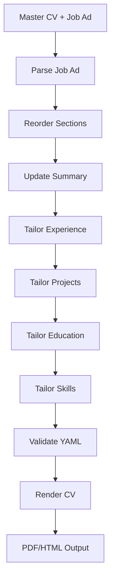

# Resume Agent - AI-Powered Resume Tailoring System

> 🤖 An intelligent resume tailoring system that automatically customizes your CV based on job advertisements using LangGraph and OpenAI's GPT-4.

[](https://www.python.org/downloads/)
[](https://openai.com/)
[](https://rendercv.com/)

## Table of Contents

- [Overview](#overview)
- [Key Features](#key-features)
- [Quick Start](#quick-start)
- [Installation](#installation)
- [Usage](#usage)
  - [Standard Workflow](#standard-workflow)
  - [Interactive Workflow](#interactive-workflow)
  - [YAML Editor](#yaml-editor)
- [Configuration](#configuration)
- [System Architecture](#system-architecture)
- [AI Safety & Accuracy](#ai-safety--accuracy)
- [Best Practices](#best-practices)
- [Troubleshooting](#troubleshooting)
- [Contributing](#contributing)

## Overview

Resume Agent uses a sophisticated multi-step AI workflow to analyze job advertisements and tailor your resume accordingly. The system ensures maximum relevance and impact while maintaining accuracy and professionalism through built-in safeguards against AI hallucination.

### What Makes Resume Agent Different

- **Anti-Hallucination Protection**: Prevents AI from inventing skills or experience not in your master CV
- **Multi-Workflow Support**: Choose between automated, interactive, or manual editing workflows  
- **Australian English Support**: Built-in localization for Australian job market
- **Professional Rendering**: Generates PDF, HTML, and other formats using RenderCV
- **Truth-First Approach**: Emphasizes honesty over perfect job matching

## Key Features

### 🎯 **Intelligent Analysis**
- **Job Advertisement Parsing**: Extracts key requirements, technologies, and company culture
- **Section Prioritization**: Reorders resume sections based on job emphasis
- **Content Optimization**: Tailors professional summary, experience, projects, and skills
- **Cross-Reference Validation**: Ensures consistency across all resume sections

### 🔒 **AI Safety & Accuracy**
- **Skills Validation**: Only mentions skills explicitly listed in your master CV
- **Experience Verification**: No professional experience is invented or inflated
- **Fallback Mechanisms**: Uses original content if AI responses are invalid
- **Truth Preservation**: Maintains honest representation of your background

### 🚀 **Multiple Workflows**
- **Standard Mode**: Fully automated resume tailoring
- **YAML Editor**: Real-time editing with live PDF preview

### 🎨 **Professional Output**
- **Multi-Format Support**: PDF, HTML, PNG, and Markdown outputs
- **RenderCV Integration**: Professional templates and themes
- **Quality Assurance**: YAML validation and error checking

## Quick Start

```bash
# 1. Clone and setup
git clone https://github.com/yourusername/Resume_Agent.git
cd Resume_Agent
pip install -r requirements.txt

# 2. Configure API key
python setup_env.py
# Edit .env file with your OpenAI API key

# 3. Prepare your files
cp master_CV_template.yaml master_CV.yaml
cp job_advertisement_template.txt job_advertisement.txt
# Edit both files with your information

# 4. Run tailoring
python run.py                    # Standard mode
python simple_yaml_editor.py     # Manual editing
```

## Installation

### Prerequisites
- Python 3.7 or higher
- OpenAI API key ([Get one here](https://platform.openai.com/api-keys))

### Step 1: Get the Code
```bash
# Option A: Clone existing repository
git clone https://github.com/yourusername/Resume_Agent.git
cd Resume_Agent

# Option B: Create new project
mkdir Resume_Agent && cd Resume_Agent
# Copy all project files here
```

### Step 2: Install Dependencies
```bash
pip install -r requirements.txt
```

> **Note**: The requirements specify `rendercv[full]` to ensure all rendering features are available. If you encounter issues, try: `pip install "rendercv[full]"`

### Step 3: Configure OpenAI API
```bash
# Recommended: Use setup script
python setup_env.py
# Then edit .env file and add your actual API key

# Alternative: Manual setup
cp env_template.txt .env
# Edit .env file manually
```

Your `.env` file should contain:
```env
OPENAI_API_KEY=your-actual-api-key-here
OPENAI_MODEL=gpt-4
OPENAI_TEMPERATURE=0.3
AUSTRALIAN_ENGLISH=false
DEBUG=false
```

## Usage

### Standard Workflow

**Best for**: Quick, fully automated resume tailoring

1. **Prepare your master resume**:
   ```bash
   cp master_CV_template.yaml master_CV.yaml
   # Edit master_CV.yaml with your complete professional information
   ```

2. **Add the job advertisement**:
   ```bash
   cp job_advertisement_template.txt job_advertisement.txt
   # Edit job_advertisement.txt with the actual job posting
   ```

3. **Run the tailoring process**:
   ```bash
   python run.py
   ```

4. **Review outputs**:
   - `working_CV.yaml`: Your tailored resume in YAML format
   - `rendercv_output/`: Rendered files (PDF, HTML, PNG, Markdown)


### YAML Editor

**Best for**: Manual fine-tuning, real-time editing, or working without AI

```bash
# Start the editor
python simple_yaml_editor.py

# Alternative launchers
python start_simple_editor.py      # Auto-setup version
start_simple_editor.bat           # Windows double-click
```

**Editor Features**:
- 🖥️ **Split-screen interface**: YAML editor + live PDF preview
- ⚡ **Real-time updates**: PDF refreshes as you type
- 💾 **Auto-save**: Changes saved automatically after 1.5 seconds
- 🎨 **Syntax highlighting**: Full YAML syntax support
- 🌙 **Dark theme**: Comfortable editing experience

Access at: `http://localhost:5000`

## Configuration

### Environment Variables

Create a `.env` file with these options:

| Variable | Required | Default | Description |
|----------|----------|---------|-------------|
| `OPENAI_API_KEY` | ✅ Yes | - | Your OpenAI API key |
| `OPENAI_MODEL` | No | `gpt-4` | Model for content generation |
| `OPENAI_TEMPERATURE` | No | `0.3` | Response randomness (0.0-1.0) |
| `AUSTRALIAN_ENGLISH` | No | `false` | Use Australian spelling |
| `DEBUG` | No | `false` | Enable debug logging |

### Australian English Support

Enable Australian English spelling throughout the tailoring process:

```env
AUSTRALIAN_ENGLISH=true
```

**Automatic conversions**:
- "color" → "colour"
- "center" → "centre"
- "organization" → "organisation"
- "realize" → "realise"
- And many more...

### Customization Options

- **Node Logic**: Modify tailoring rules in `nodes/` directory
- **Workflow Sequence**: Adjust processing order in `run.py`
- **Templates**: Customize `master_CV_template.yaml` structure
- **Rendering**: Configure RenderCV themes and formats

## System Architecture

```
Resume_Agent/
├── 📁 nodes/                    # LangGraph workflow nodes
│   ├── parse_job_ad.py         # Job advertisement analysis
│   ├── reorder_sections.py     # Section prioritization
│   ├── update_summary.py       # Professional summary tailoring
│   ├── tailor_*.py             # Content tailoring nodes
│   ├── validate_yaml.py        # YAML validation
│   └── json_utils.py           # Utility functions
├── 📁 utils/                    # Shared utilities

│   └── text_utils.py           # Text processing utilities
├── 📁 markdown/                 # RenderCV templates
├── 📁 rendercv_output/          # Generated CV files
├── 🐍 run.py                   # Standard workflow entry point

├── 🐍 simple_yaml_editor.py    # YAML editor with live preview
├── 🐍 state.py                 # State management
├── 📋 requirements.txt         # Python dependencies
└── 📄 README.md               # This documentation
```

### Data Flow



## AI Safety & Accuracy

Resume Agent implements comprehensive safeguards to ensure truthful and accurate resume tailoring:

### 🛡️ Anti-Hallucination Protection

- **Skills Validation**: AI can only mention skills explicitly listed in your master CV
- **Experience Verification**: No professional experience is invented or inflated
- **Cross-Reference Checks**: Every claim is validated against your actual background
- **Fallback Mechanisms**: Invalid AI responses trigger fallback to original content

### 🎯 Truthfulness Emphasis

- **Honest Transitions**: Career changes presented truthfully (e.g., "Professional transitioning to [field]")
- **Experience Level Accuracy**: Clear distinction between professional work and academic/project experience
- **No Skill Invention**: Technical skills only mentioned if they exist in your skills section
- **Background Preservation**: Your genuine strengths emphasized over perfect job matching

### ⚙️ Technical Safeguards

- **Prompt Optimization**: Reusable prompts that work for any candidate background
- **Model Selection**: GPT-4 for content generation, GPT-3.5-turbo for job analysis
- **Token Management**: Efficient prompting to minimize costs while maintaining quality
- **Error Handling**: Comprehensive error recovery and logging

## Best Practices

### 📝 Master Resume Preparation

1. **Be Comprehensive**: Include all your experience, skills, and achievements
2. **Stay Accurate**: Ensure all dates, companies, and details are correct
3. **Use Specific Terms**: Include technical terms, tools, and methodologies
4. **Quantify Achievements**: Include metrics and measurable outcomes where possible
5. **Keep Updated**: Regularly add new experiences and skills

### 🎯 Job Advertisement Analysis

1. **Complete Postings**: Include full job descriptions, not just summaries
2. **Company Context**: Add company information and culture details when available
3. **Requirements Focus**: Ensure both required and preferred qualifications are included
4. **Technical Details**: Include specific technologies, tools, and methodologies mentioned

### 🔍 Review and Validation

1. **Human Review**: Always review AI-generated changes before submission
2. **Accuracy Check**: Verify all claims and achievements remain truthful
3. **Formatting Review**: Check PDF output for proper formatting and layout
4. **Multiple Versions**: Consider creating different versions for different types of roles

## Troubleshooting

### 🔧 Common Issues

**OpenAI API Errors**
```bash
# Check API key configuration
cat .env | grep OPENAI_API_KEY

# Verify API usage and billing
# Visit: https://platform.openai.com/usage

# Test API connection
python -c "import openai; print('API connection successful')"
```

**YAML Validation Errors**
```bash
# Check YAML syntax
python -c "import yaml; yaml.safe_load(open('master_CV.yaml'))"

# Common issues:
# - Incorrect indentation (use spaces, not tabs)
# - Missing required fields
# - Unescaped special characters
```

**RenderCV Rendering Issues**
```bash
# Verify RenderCV installation
python -m rendercv --version

# Install full version if needed
pip install "rendercv[full]"

# Test rendering manually
python -m rendercv render working_CV.yaml
```


### 🔍 Debug Mode

Enable detailed logging:

```bash
# Method 1: Environment variable
DEBUG=true python run.py

# Method 2: Command line logging
python -u run.py 2>&1 | tee tailoring.log


```

### 📊 Validation Commands

```bash
# Validate master CV structure
python -c "
from state import load_cv_from_file
cv = load_cv_from_file('master_CV.yaml')
print(f'CV Name: {cv[\"cv\"][\"name\"]}')
print(f'Sections: {list(cv[\"cv\"][\"sections\"].keys())}')
"

# Check job advertisement
wc -w job_advertisement.txt  # Word count should be substantial

# Verify output files
ls -la working_CV.yaml rendercv_output/
```

## Contributing

### 🚀 Extending the System

**Add New Tailoring Nodes**
```python
# 1. Create new node in nodes/
def tailor_new_section(state: ResumeState) -> ResumeState:
    # Implementation here
    return state

# 2. Add to workflow in run.py
workflow.add_node("tailor_new_section", tailor_new_section)
workflow.add_edge("previous_node", "tailor_new_section")
```

**Modify Workflow Sequence**
```python
# Edit run.py setup_workflow() function
# Reorder or add new edges between nodes
```

**Custom Validation Rules**
```python
# Edit nodes/validate_yaml.py
# Add new validation checks for your requirements
```

### 🔄 GitHub Setup

**Create Your Own Repository**
```bash
# Initialize git (if not already done)
git init
git add .
git commit -m "Initial commit - Resume Agent"

# Create GitHub repository, then:
git remote add origin https://github.com/yourusername/Resume_Agent.git
git branch -M main
git push -u origin main
```

**Files Automatically Excluded** (via `.gitignore`)
- ✅ `.env` - Your API keys
- ✅ `master_CV.yaml` - Your personal resume
- ✅ `job_advertisement.txt` - Your job postings  
- ✅ `working_CV.yaml` - Generated outputs
- ✅ `rendercv_output/` - All rendered files

**Template Files Included**
- ✅ `master_CV_template.yaml` - Resume template
- ✅ `job_advertisement_template.txt` - Job posting template
- ✅ `env_template.txt` - Environment template
- ✅ All source code and documentation

## Output Files

After running the tailoring process, you'll find:

### 📁 Generated Files
- **`working_CV.yaml`**: Your tailored resume in RenderCV format
- **`rendercv_output/`**: Directory containing:
  - 📄 **PDF**: Professional print-ready version
  - 🌐 **HTML**: Web-friendly version with styling
  - 🖼️ **PNG**: Image versions of each page
  - 📝 **Markdown**: Text version for further editing

### 📊 File Structure
```
rendercv_output/
├── working_CV.pdf          # Main PDF output
├── working_CV.html         # Web version
├── working_CV_page_1.png   # Page images
├── working_CV_page_2.png   # ...
└── working_CV.md           # Markdown version
```

---

## Support & Resources

- 📖 **Documentation**: This README and inline code comments
- 🐛 **Issues**: Check console output and error messages
- 🔧 **Debugging**: Check console output and error messages for detailed information
- 🌐 **OpenAI**: [Platform documentation](https://platform.openai.com/docs)
- 🎨 **RenderCV**: [Official documentation](https://rendercv.com/)

---

**⚠️ Important**: This system assists with resume tailoring but does not replace human judgment. Always review and verify generated content before submitting applications. The system emphasizes truthfulness and accuracy over perfect job matching.

---

*Made with ❤️ for job seekers who value both efficiency and integrity in their application process.* 